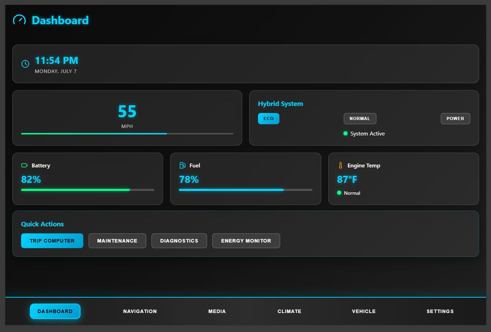

# Toyota Prius 2010 Hybrid Infotainment System



A modern, React-based infotainment system designed specifically for the Toyota Prius 2010 hybrid vehicle. This system provides a comprehensive dashboard with multiple screens for vehicle management, entertainment, and navigation.

## Features

### 🚗 Dashboard
- Real-time vehicle metrics (speed, fuel, battery)
- Hybrid system status and mode selection (ECO, Normal, Power)
- Engine temperature monitoring
- Time and date display
- Quick action buttons

### 🗺️ Navigation
- Destination search functionality
- Route planning with distance, duration, and arrival time
- Favorite destinations management
- Interactive map placeholder
- Navigation settings (avoid highways, tolls, eco route)

### 🎵 Media Player
- Multi-source audio support (Bluetooth, USB, Radio)
- Music playlist management
- Radio station selection
- Volume and playback controls
- Track progress visualization

### 🌡️ Climate Control
- Temperature control for driver and passenger (dual-zone)
- Fan speed adjustment
- Air direction selection (face, feet, windshield, mixed)
- Climate mode selection (auto, heat, cool, defrost)
- Recirculation and defrost controls

### 🔧 Vehicle Information
- Comprehensive vehicle metrics and diagnostics
- Trip computer (Trip A & B with reset functionality)
- Hybrid system health monitoring
- Maintenance schedule tracking
- System diagnostics with status indicators

### ⚙️ Settings
- Display settings (brightness, theme selection)
- Audio configuration
- Bluetooth and Wi-Fi connectivity
- System preferences (time format, units, language)
- Security and privacy controls

## Technology Stack

- **Frontend**: React 18 with TypeScript
- **Build Tool**: Vite
- **Icons**: Lucide React
- **Styling**: Custom CSS with modern glassmorphism design
- **Responsive**: Mobile-friendly design

## Design Features

- **Modern UI**: Dark theme with cyan accent colors
- **Glassmorphism**: Translucent cards with backdrop blur effects
- **Responsive**: Adapts to different screen sizes
- **Animations**: Smooth transitions and hover effects
- **Toyota Prius Themed**: Specifically designed for hybrid vehicle aesthetics

## Getting Started

### Prerequisites
- Node.js (v16 or higher)
- npm or yarn

### Installation

1. Install dependencies:
```bash
npm install
```

2. Start the development server:
```bash
npm run dev
```

3. Open your browser and navigate to the provided URL

### Building for Production

```bash
npm run build
```

## Project Structure

```
src/
├── components/
│   ├── Dashboard.tsx      # Main dashboard with vehicle metrics
│   ├── Navigation.tsx     # GPS navigation and route planning
│   ├── MediaPlayer.tsx    # Audio/media controls
│   ├── Climate.tsx        # Climate control system
│   ├── VehicleInfo.tsx    # Vehicle diagnostics and information
│   └── Settings.tsx       # System settings and preferences
├── App.tsx               # Main application component
├── App.css              # Global styles and theme
└── main.tsx             # Application entry point
```

## Key Components

### Dashboard
- Real-time speed display with progress bar
- Hybrid system mode selector
- Battery and fuel level indicators
- Engine temperature monitoring
- Quick access buttons

### Navigation
- Search functionality for destinations
- Favorite locations management
- Route information display
- Map controls placeholder
- Navigation preferences

### Media Player
- Source selection (Bluetooth, USB, Radio)
- Playlist management
- Radio station browser
- Playback controls
- Volume adjustment

### Climate Control
- Dual-zone temperature control
- Fan speed slider
- Air direction buttons
- Climate mode selection
- System status indicators

### Vehicle Information
- Odometer and trip computers
- Hybrid system health metrics
- Maintenance schedule
- System diagnostics
- Vehicle statistics

### Settings
- Display customization
- Audio preferences
- Connectivity options
- System configuration
- About information

## Screenshots

The system features a modern dark theme with cyan accents, designed specifically for automotive use:

- **Dashboard**: Central hub with real-time vehicle data
- **Navigation**: Clean interface for route planning
- **Media**: Intuitive controls for audio management
- **Climate**: Easy-to-use temperature and air controls
- **Vehicle**: Comprehensive diagnostics and information
- **Settings**: Full system customization options

## Customization

The system is designed to be easily customizable:

- **Colors**: Modify the CSS custom properties in `App.css`
- **Components**: Add new screens by creating components and updating the navigation
- **Data**: Replace mock data with real vehicle API integration
- **Styling**: Adjust the glassmorphism effects and animations

## Future Enhancements

- Real vehicle data integration via OBD-II
- GPS integration for actual navigation
- Voice command support
- Mobile app connectivity
- Cloud synchronization
- Advanced diagnostics
- Fuel efficiency analytics

## Browser Compatibility

- Chrome/Chromium (recommended)
- Firefox
- Safari
- Edge

## License

This project is designed as a demonstration of modern infotainment system UI/UX for the Toyota Prius 2010 hybrid vehicle.